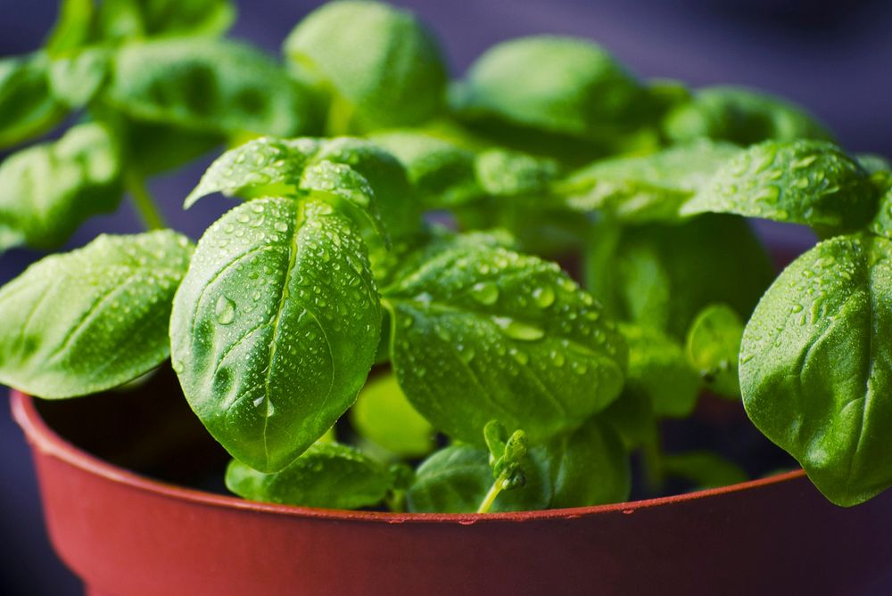

# Basil's Configuration



A super configuration, that, once you're aware of it, does nothing other than continue to be kind of useful for DevOps, learning about IaaS, PaaS tools, and automation in general.

### Getting started

```sh
git clone https://github.com/1NF053C/config.git

./generate_node_starter.sh

# Results:
#
# 1. The latest version of https://github.com/1NF053C/config.git will be used
# to create your TypeScript Node.js app at ${HOME}/app with apptainer build and run definitions
#
# 2. A latest copy of https://github.com/1NF053C/config.git repo is cloned at "${HOME}/.config/config"
#
```
